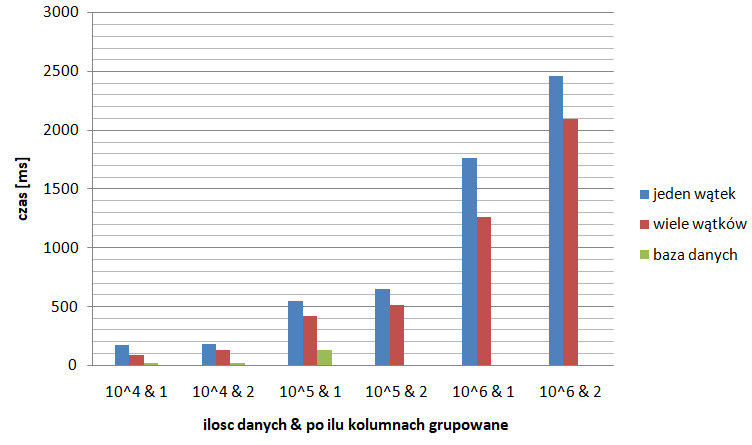

# DataFrame
Struktura danych do przechowywania ramek danych i metody działajace na niej, 
porównanie czasu wykonywania group by na danych przez program jednowątkowy, wielowątkowy i bazę danych PostgreSQL połączoną z aplikacją.

## Klasy:
DataFrame - zwykła jednowatkowa klasa do obsługi ramek danych \
SparseDataFrame - dziedziczaca klasa po DataFrame dla rzadkich danych (wiele 0) \
DataFrameDB - dziedziczaca klasa po DataFrame do obsługi ramek danych przez baze danych \
DataFrameMultiThreads - wielowatkowa klasa do obsługi ramek danych(wielowątkowe operacje max,min.. i groupby)

## Pliki:
ZestawienieWynikow.xlsx - porówananie czasów grupowania dla programu jednowatkowego, wielowatkowego i bazy danych.
wyniki.csv - dane do zestawienia

## Podsumowanie:

*brak danych dla bazy danych dla ostatnich 3 kategorii*
